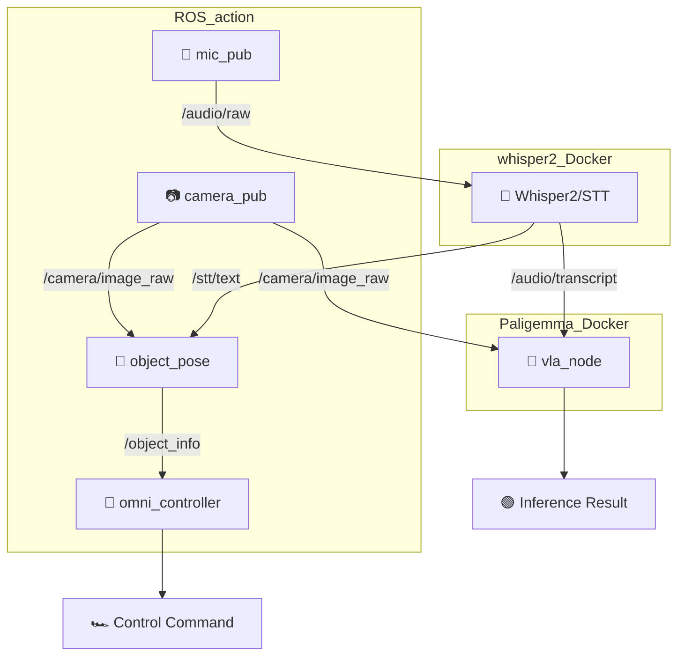

# 🤖 VLA (Vision-Language-Action) Robot System

Jetson 기반 ROS2 멀티모달 로봇 제어 시스템

[](https://docs.ros.org/en/humble/)
[](https://developer.nvidia.com/cuda-toolkit)
[](https://www.python.org/)
[](https://www.docker.com/)

---
## 📋 **프로젝트 개요**

이 프로젝트는 **음성 명령**과 **카메라 입력**을 통해 로봇을 지능적으로 제어하는 VLA (Vision-Language-Action)의 프로토타입 시스템입니다.  
Jetson 플랫폼에서 ROS2를 기반으로 구현되었으며, AI 모델을 활용한 현재 상황 추론과 음성 명령 기반 로봇 제어를 제공합니다.

---

### **📋 시스템 환경**
- **Platform**: NVIDIA Orin NX 16GB
- **OS**: Ubuntu 22.04 (Jetpack 6.x)
- **ROS2**: Humble Hawksbill
- **CUDA**: 12.2+
- **Python**: 3.10+
- **Docker**: 20.10+  

---

### **🎯 주요 기능 및 동작 흐름**
- **🎤 음성 인식 (STT)**
    - Whisper 기반 음성 인식기로부터 명령어를 받아 텍스트로 변환하고,
    - VLM 입력으로 사용되어 **상황 판단**에 활용되며,
    - 텍스트 내 "사람", "의자", "노트북" 등의 키워드를 추출하여 **목표 객체**로 자동 설정합니다.  

- **📷 시각 인식 및 객체 검출**
    - VLM 입력으로 사용되어 상황 판단에 활용되며,
    - YOLO를 통해 설정된 객체를 탐지하고,
    - 바운딩박스 중심 좌표를 기반으로 **객체의 위치를 추정**합니다.

- **🎯 방향 계산**
    - 탐지된 객체의 **중심 좌표**를 이용해 로봇 기준의 **상대 방향(각도)을 계산**합니다.  

- **🧠 상황 인식 (VLM)**
    - Paligemma 기반 멀티모달 AI를 통해 **현재 상황**에 대한 **고차원적인 해석**이 가능하며,
    - 향후 VLA(Vision-Language-Action) 구조로 확장될 수 있습니다.  

- **🚗 정밀 이동 제어**
    - 계산된 방향 및 거리 정보는 /object_info 토픽으로 퍼블리시되며, 
    - 로봇은 해당 정보를 바탕으로 **목표 객체를 향해 회전 및 전진**합니다.
    - 목표에 근접하면 **센서 값**에 따라 **자동 정지**합니다.

<br>


## 🏗️ **시스템 아키텍처**



### **📦 노드별 역할**

| **노드** | **기능** | **입력** | **출력** |
|----------|----------|----------|----------|
| `mic_pub` | Audio capture | 🎤 Jetson mic | `/audio/raw` |
| `whisper2` | Speech-to-Text | `/audio/raw` | `/stt/text`, `/audio/transcript` |
| `camera_pub` | Image capture | 📷 CSI camera | `/camera/image_raw` |
| `camera_sub` | Image subscriber | `/camera/image_raw` |
| `object_pose` | Object localization	 | `/camera/image_raw` + `/stt/text` | `/object/pose` |
| `vla_node` | Multimodal inference | `/camera/image_raw` + `/audio/transcript` | Inference Result |
| `omni_controller` | Hardware Control | `/object_info` | Control command |
<br>

## 📁 **프로젝트 구조**

```
vla/
├── Model_ws/        # 🧠 VLM 모델 워크스페이스
│   └── src/
│       └── vla_node/           # 상황 추론 노드
│           └── vla_node/simple_inference.py
│
├── ROS_action/                 # 🤖 메인 ROS2 워크스페이스
│   └── src/                    
│       ├── camera_pub/         # 📷 Camera Publihser
│       │   └── camera_pub/camera_publisher_node.py
│       │
│       ├── camera_sub/         # 📷 Camera Subscriber(Image Saver)
│       │   └── camera_sub/camera_subscriber_node.py
│       │
│       ├── mic_pub/            # 🎤 Audio Publisher
│       │   └── mic_pub/mic_publisher_node.py
│       │
│       ├── object_pose/        # 🎯 객체(목표) 위치 추정
│       │   └── object_pose/
│       │       ├── chair_publisher.py # 테스트용: chair.png → /camera/image_raw publisher
│       │       └── object_pose_publisher.py 
│       │
│       ├── omni_controller/    # 🚗 옴니휠 제어
│       │   └── omni_controller/omni_drive_node.py
│       │    
│       └── custom_msgs/    # 🔗 커스텀 메시지(ObjectInfo(angle, distance)
│           └── msg/ObjectInfo.msg
│
└── whisper2/         
    ├── Dockerfile    # Docker 컨테이너 설정
    ├── ros2_ws/      # 🧠 STT 모델 워크스페이스
    │   └── src/
    │       └── whisper_stt/    # Whisper STT 패키지
    │           └── whisper_stt/
    │               ├── whisper_stt_node.py    # 5초 단위 수행
    │               └── whisperTest.py         # 단일 수행
    ├── whisper_test.py    # whisper 독립 실행 테스트 스크립트
    └── sample.wav         # 테스트용 오디오 파일

```
<br>

## 👥 **개발팀**

| **역할** | **담당자** | **GitHub** |
|----------|-----------|------------|
| 🎤 Audio & STT | @윤지우, @양동건 | [@wehaveaeraser](https://github.com/wehaveaeraser), [@KNDG01001](https://github.com/KNDG01001) |
| 🧠 VLM & AI | @이민우, @하유빈 | [@minuum](https://github.com/minuum), [@Kyle-Riss](https://github.com/Kyle-Riss) |
| 📷 Camera & 🚗 Robot Control| @최용석 | [@shosae](https://github.com/shosae) |
---
