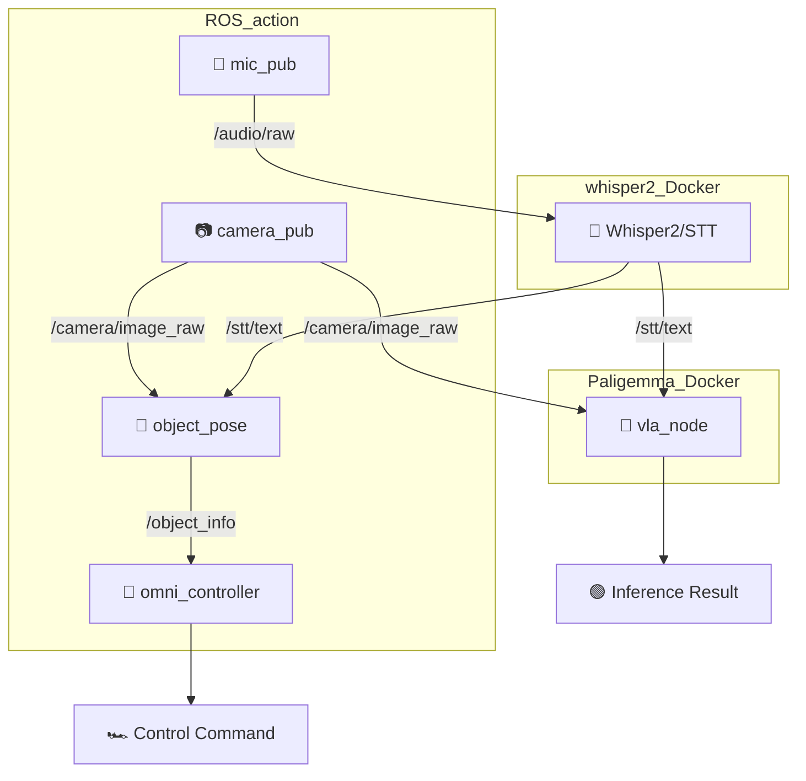

# 🤖 VLA (Vision-Language-Action) Robot System

Jetson 기반 ROS2 멀티모달 로봇 제어 시스템

[](https://docs.ros.org/en/humble/)
[](https://developer.nvidia.com/cuda-toolkit)
[](https://www.python.org/)
[](https://www.docker.com/)

---

## 📋 **프로젝트 개요**

이 프로젝트는 **음성 명령**과 **카메라 입력**을 통해 로봇을 지능적으로 제어하는 VLA (Vision-Language-Action)의 프로토타입 시스템입니다. 
Jetson 플랫폼에서 ROS2를 기반으로 구현되었으며, AI 모델을 활용한 현재 상황 추론과 음성 명령 기반 로봇 제어를 제공합니다.

---

### **📋 시스템 환경**
- **Platform**: NVIDIA Orin NX 16GB
- **OS**: Ubuntu 22.04
- **ROS2**: Humble Hawksbill
- **CUDA**: 12.2+
- **Python**: 3.10+
- **Docker**: 20.10+  

### **🎯 주요 기능**
- 🎤 **음성 인식**: Whisper 기반 STT로 자연어 명령 처리
- 📷 **시각 인식**: 실시간 카메라 이미지 처리
- 🎯 **목표 인식**: 이미지를 기반으로 목표까지의 방향 추정 
- 🧠 **VLM 추론**: 멀티모달 AI(Paligemma)를 통한 현재 상황 인식
- 🚗 **옴니휠 제어**: 정밀한 로봇 이동 제어
<br>


## 🏗️ **시스템 아키텍처**



### **📦 노드별 역할**

| **노드** | **기능** | **입력** | **출력** |
|----------|----------|----------|----------|
| `mic_pub` | Audio capture | 🎤 Jetson mic | `/audio/raw` |
| `whisper2` | Speech-to-Text | `/audio/raw` | `/stt/text` |
| `camera_pub` | Image capture | 📷 CSI camera | `/camera/image_raw` |
| `camera_sub` | Image subscriber | `/camera/image_raw` |
| `object_pose` | Object localization	 | `/camera/image_raw` + `/stt/text` | `/object/pose` |
| `vla_node` | Multimodal inference | `/camera/image_raw` + `/stt/text` | Inference Result |
| `omni_controller` | Hardware Control | `/object_info` | Control command |
<br>

## 📁 **프로젝트 구조**

```
vla/
├── Model_ws/        # 🧠 VLM 모델 워크스페이스
│   └── src/
│       └── vla_node/           # 상황 추론 노드
│           └── vla_node/simple_inference.py
│
├── ROS_action/                 # 🤖 메인 ROS2 워크스페이스
│   └── src/                    
│       ├── camera_pub/         # 📷 Camera Publihser
│       │   └── camera_pub/camera_publisher_node.py
│       │
│       ├── camera_sub/         # 📷 Camera Subscriber
│       │   └── camera_sub/camera_subscriber_node.py
│       │
│       ├── mic_pub/            # 🎤 Mic Publisher
│       │   └── mic_pub/mic_publisher_node.py
│       │
│       ├── object_pose/        # 🎯 객체(목표) 위치 추정
│       │   └── object_pose/
│       │       ├── cup_publisher.py # 테스트 스크립트
│       │       └── object_pose_publisher.py 
│       │
│       ├── omni_controller/    # 🚗 옴니휠 제어
│       │   └── omni_controller/omni_drive_node.py
│       │
│       └── ros_action_msgs/    # 🔗 커스텀 메시지
│           └── msg/ObjectInfo.msg
│
└── whisper2/
    ├── Dockerfile    # Docker 컨테이너 설정
    ├── ros2_ws/      # ROS2 워크스페이스
    │   └── src/
    │       └── whisper_stt/    # Whisper STT 패키지
    │           └── whisper_stt/
    │               ├── whisper_stt_node.py    # 5초 단위 수행
    │               └── whisperTest.py         # 단일 수행
    ├── whisper_test.py    # whisper 독립 실행 테스트 스크립트
    └── sample.wav         # 테스트용 오디오 파일

```
<br>

## 👥 **개발팀**

| **역할** | **담당자** | **GitHub** |
|----------|-----------|------------|
| 🎤 Audio & STT | @윤지우, @양동건 | [@wehaveaeraser](https://github.com/wehaveaeraser), [@KNDG01001](https://github.com/KNDG01001) |
| 🧠 VLM & AI | @이민우, @하유빈 | [@minuum](https://github.com/minuum), [@Kyle-Riss](https://github.com/Kyle-Riss) |
| 📷 Camera & 🚗 Robot Control| @최용석 | [@shosae](https://github.com/shosae) |
---
