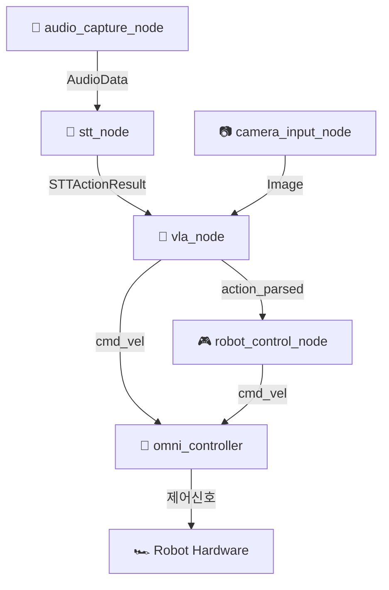

# 🤖 VLA (Vision-Language-Action) Robot System

Jetson 기반 ROS2 멀티모달 로봇 제어 시스템

[](https://docs.ros.org/en/humble/)
[](https://developer.nvidia.com/cuda-toolkit)
[](https://www.python.org/)
[](https://www.docker.com/)

---

## 📋 **프로젝트 개요**

이 프로젝트는 **음성 명령**과 **카메라 입력**을 통해 로봇을 지능적으로 제어하는 VLA (Vision-Language-Action) 시스템입니다. Jetson 플랫폼에서 ROS2를 기반으로 구현되었으며, AI 모델을 활용한 멀티모달 로봇 제어를 제공합니다.

### **🎯 주요 기능**
- 🎤 **음성 인식**: Whisper 기반 STT로 자연어 명령 처리
- 📷 **시각 인식**: 실시간 카메라 이미지 처리
- 🧠 **VLA 추론**: 멀티모달 AI를 통한 지능적 행동 결정
- 🚗 **옴니휠 제어**: 정밀한 로봇 이동 제어
- 🛡️ **안전 시스템**: 센서 기반 장애물 감지 및 회피

---

## 🏗️ **시스템 아키텍처**



### **📦 노드별 역할**

| **노드** | **기능** | **입력** | **출력** | **상태** |
|----------|----------|----------|----------|----------|
| `audio_capture_node` | 마이크 오디오 캡처 | 🎤 Jetson Mic | `/audio/raw` | ✅ 완료 |
| `stt_node` | 음성 텍스트 변환 | `/audio/raw` | `/stt_action` | 🔄 진행중 |
| `camera_input_node` | 카메라 이미지 캡처 | 📷 CSI/USB Camera | `/camera/image_raw` | ✅ 완료 |
| `vla_node` | VLA 멀티모달 추론 | Image + Text | `/cmd_vel` or `/vla/action_parsed` | 🔄 진행중 |
| `robot_control_node` | 행동 텍스트 파싱 | `/vla/action_parsed` | `/cmd_vel` | ⏳ 대기 |
| `omni_controller` | 옴니휠 로봇 제어 | `/cmd_vel` | Hardware Control | ✅ 완료 |

---

## 📁 **프로젝트 구조**

```
vla/
├── README.md                    # 📖 프로젝트 메인 문서
├── RoboVLMs/                   # 🧠 VLA 모델 서브모듈
│   ├── robovlms/               # VLA 모델 코어
│   │   ├── robovlms/
│   │   │   └── robovlms.py
│   │   ├── whisper/                # STT Docker 환경
│   │   │   ├── whisper/
│   │   │   │   └── whisper.py
│   │   │   ├── Dockerfile
│   │   │   └── docker-compose.yml
│   │   ├── configs/                # 모델 설정 파일
│   │   │   └── config.yaml
│   │   └── scripts/                # 유틸리티 스크립트
│   └── ROS_action/                 # 🤖 ROS2 워크스페이스
│       ├── build/                  # 빌드 결과물
│       ├── install/                # 설치된 패키지
│       ├── log/                    # 로그 파일
│       ├── src/                    # 소스 코드
│       │   ├── audio_capture_package/     # 🎤 오디오 캡처
│       │   │   ├── audio_capture_package/
│       │   │   │   └── audio_capture_node.py
│       │   │   ├── package.xml
│       │   │   └── setup.py
│       │   ├── camera_pub/               # 📷 카메라 퍼블리셔
│       │   │   ├── camera_pub/
│       │   │   │   └── camera_publisher_node.py
│       │   │   ├── package.xml
│       │   │   └── setup.py
│       │   ├── vla_node/                 # 🧠 VLA 추론 노드
│       │   │   ├── vla_node/
│       │   │   │   └── vla_node.py
│       │   │   ├── package.xml
│       │   │   └── setup.py
│       │   ├── omni_controller/          # 🚗 로봇 제어
│       │   │   ├── omni_controller/
│       │   │   │   └── omni_drive_node.py
│       │   │   ├── package.xml
│       │   │   └── setup.py
│       │   └── custom_interfaces/        # 🔗 커스텀 메시지
│       │       ├── action/
│       │       │   └── STTAction.action
│       │       ├── msg/
│       │       └── srv/
│       └── vla_system_launch.py    # 🚀 시스템 런치 파일
└── docs/                       # 📚 추가 문서
    ├── installation.md         # 설치 가이드
    ├── troubleshooting.md      # 문제 해결
    └── api_reference.md        # API 레퍼런스
```

---

## 🔧 **설치 가이드**

### **📋 시스템 요구사항**
- **하드웨어**: NVIDIA Jetson Nano/Xavier/Orin
- **OS**: Ubuntu 20.04/22.04 (ARM64)
- **ROS2**: Humble Hawksbill
- **CUDA**: 11.8+
- **Python**: 3.8+
- **Docker**: 20.10+

### **1️⃣ ROS2 환경 설정**

```bash
# ROS2 Humble 설치 (이미 설치된 경우 스킵)
sudo apt update
sudo apt install ros-humble-desktop
source /opt/ros/humble/setup.bash

# 의존성 설치
sudo apt install python3-colcon-common-extensions
sudo apt install ros-humble-cv-bridge ros-humble-image-transport
sudo apt install ros-humble-audio-common-msgs
```

### **2️⃣ 프로젝트 클론 및 설정**

```bash
# 프로젝트 클론
git clone https://github.com/minuum/vla.git
cd vla

# 서브모듈 초기화
git submodule update --init --recursive

# ROS2 워크스페이스 빌드
cd ROS_action
colcon build
source install/setup.bash
```

### **3️⃣ AI 모델 환경 설정**

```bash
# Python 의존성 설치
pip install torch transformers pillow opencv-python
pip install whisper-openai

# VLA 모델 캐시 디렉토리 생성
mkdir -p .vla_models_cache
```

### **4️⃣ STT Docker 환경 설정**

```bash
# STT Docker 이미지 빌드
cd RoboVLMs/whisper
docker build -t whisper-stt .
```

---

## 🚀 **실행 가이드**

### **🎯 전체 시스템 실행**

```bash
# 1. ROS2 환경 설정
cd ~/vla/ROS_action
source install/setup.bash
export ROS_DOMAIN_ID=20

# 2. STT Docker 컨테이너 실행 (별도 터미널)
cd ~/vla/RoboVLMs/whisper
docker run --rm -it --network="host" --gpus all whisper-stt

# 3. 메인 시스템 실행 (메인 터미널)
ros2 launch vla_system_launch.py
```

### **🔧 개별 노드 실행**

#### **카메라 노드**
```bash
# Jetson CSI 카메라
ros2 run camera_pub camera_publisher_node

# USB 카메라
ros2 run camera_pub camera_publisher_node \
  --ros-args -p use_gstreamer:=false -p camera_device:=0
```

#### **오디오 캡처 노드**
```bash
ros2 run audio_capture_package audio_capture_node
```

#### **VLA 추론 노드**
```bash
# GPU 모드 (권장)
ros2 run vla_node vla_node

# CPU 모드
ros2 run vla_node vla_node \
  --ros-args -p device_preference:=cpu
```

#### **로봇 제어 노드**
```bash
# 실제 하드웨어
ros2 run omni_controller omni_drive_node

# 시뮬레이션 모드
ros2 run omni_controller omni_drive_node \
  --ros-args -p simulation_mode:=true
```

---

## 🎮 **사용법**

### **🎤 음성 명령 예시**
- **"move forward"** - 전진
- **"turn left"** - 좌회전
- **"turn right"** - 우회전
- **"stop"** - 정지
- **"navigate to the chair"** - 의자로 이동
- **"avoid obstacle"** - 장애물 회피

### **🖥️ 시스템 모니터링**

```bash
# 활성 노드 확인
ros2 node list

# 토픽 목록 확인
ros2 topic list

# 실시간 로그 확인
ros2 launch vla_system_launch.py log_level:=debug

# 특정 토픽 모니터링
ros2 topic echo /cmd_vel
ros2 topic echo /vla/status
```

### **🧪 수동 테스트**

```bash
# 수동 cmd_vel 명령
ros2 topic pub /cmd_vel geometry_msgs/msg/Twist \
  '{linear: {x: 0.2}, angular: {z: 0.0}}'

# 수동 STT 텍스트 입력
ros2 topic pub /stt/text std_msgs/msg/String \
  '{data: "move forward"}'
```

---

## 📊 **시스템 상태**

### **✅ 완료된 기능**
- [x] 카메라 이미지 캡처 및 퍼블리시
- [x] 오디오 캡처 시스템
- [x] 옴니휠 로봇 제어 (센서 안전 기능 포함)
- [x] VLA 추론 노드 기본 구조
- [x] STT Docker 환경 최적화

### **🔄 진행 중인 작업**
- [ ] STT 노드 통신 테스트 및 정확성 검증
- [ ] VLA 모델 완전 통합
- [ ] 노드 간 통합 테스트

### **⏳ 예정된 기능**
- [ ] End-to-End 시스템 테스트
- [ ] 성능 최적화
- [ ] 추가 음성 명령 지원
- [ ] 웹 기반 모니터링 인터페이스

---

## 🐛 **문제 해결**

### **자주 발생하는 문제**

#### **1. 카메라 연결 실패**
```bash
# 카메라 장치 확인
ls /dev/video*

# USB 카메라로 전환
ros2 run camera_pub camera_publisher_node \
  --ros-args -p use_gstreamer:=false
```

#### **2. GPU 메모리 부족**
```bash
# GPU 메모리 확인
nvidia-smi

# CPU 모드로 실행
ros2 run vla_node vla_node \
  --ros-args -p device_preference:=cpu
```

#### **3. ROS2 통신 문제**
```bash
# ROS Domain ID 설정
export ROS_DOMAIN_ID=20

# 네트워크 설정 확인
sudo ufw disable  # 방화벽 임시 비활성화
```

더 자세한 문제 해결은 [`docs/troubleshooting.md`](docs/troubleshooting.md)를 참조하세요.

---

## 🤝 **기여하기**

### **개발 워크플로우**
1. Fork 프로젝트
2. Feature 브랜치 생성 (`git checkout -b feature/amazing-feature`)
3. 변경 사항 커밋 (`git commit -m 'Add some amazing feature'`)
4. 브랜치에 Push (`git push origin feature/amazing-feature`)
5. Pull Request 생성

### **코딩 스타일**
- Python: PEP 8 준수
- C++: ROS2 코딩 스타일 가이드 준수
- 한국어 주석 권장

---

## 👥 **개발팀**

| **역할** | **담당자** | **GitHub** |
|----------|-----------|------------|
| 🎤 Audio & STT | @jiwoo | [@jiwoo](https://github.com/jiwoo) |
| 📷 Camera & Hardware | @최용석 | [@choiyongseok](https://github.com/choiyongseok) |
| 🧠 VLA & AI | @이민우, @YUBEEN | [@minwoo](https://github.com/minwoo), [@yubeen](https://github.com/yubeen) |
| 🚗 Robot Control | @양동건 | [@yangdonggun](https://github.com/KNDG01001) |

---

## 📄 **라이선스**

이 프로젝트는 MIT 라이선스 하에 배포됩니다. 자세한 내용은 [LICENSE](LICENSE) 파일을 참조하세요.

---

## 🙏 **감사의 말**

- [ROS2](https://docs.ros.org/en/humble/) - 로봇 운영 체제
- [OpenAI Whisper](https://github.com/openai/whisper) - 음성 인식 모델
- [Transformers](https://huggingface.co/transformers/) - VLA 모델 프레임워크
- [PaliGemma](https://huggingface.co/google/paligemma-3b-mix-224) - 멀티모달 모델

---

**🚀 VLA 로봇과 함께 미래의 스마트 로봇 제어를 경험해보세요!** 
