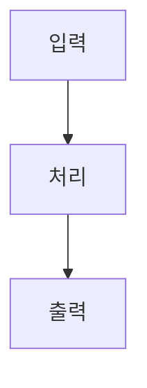

# 👥 VLA 프로젝트 팀 협업 가이드

팀원간 효율적인 협업을 위한 역할 분담 및 개발 프로세스 가이드

---

## 🎯 **팀 구성 및 역할 분담**

### **📋 전체 팀 구성**

| **팀원** | **주요 역할** | **담당 영역** | **GitHub** | **상태** |
|----------|---------------|---------------|------------|----------|
| **@jiwoo** | 🎤 Audio & STT | 음성 처리, STT 서버 | [@jiwoo](https://github.com/jiwoo) | 🔄 활성 |
| **@최용석** | 📷 Camera & Hardware | 카메라, 하드웨어 제어 | [@choiyongseok](https://github.com/choiyongseok) | ✅ 활성 |
| **@이민우** | 🧠 VLA & AI (Lead) | VLA 모델, 시스템 통합 | [@minwoo](https://github.com/minwoo) | 🔄 활성 |
| **@YUBEEN** | 🧠 VLA & AI (Support) | VLA 모델, 알고리즘 | [@yubeen](https://github.com/yubeen) | ⏳ 활성 |
| **@양동건** | 🚗 Robot Control | 로봇 제어, 모션 플래닝 | [@yangdonggun](https://github.com/yangdonggun) | ✅ 활성 |

---

## 📁 **디렉토리별 담당자 및 책임**

### **🎤 Audio & STT (@jiwoo)**

#### **담당 디렉토리:**
```
RoboVLMs/whisper/                    # STT Docker 환경
├── Dockerfile                      # Docker 설정
├── requirements.txt                # Python 의존성
├── whisper_node.py                 # STT ROS2 노드
└── README.md                       # STT 모듈 가이드

ROS_action/src/audio_capture_package/ # 오디오 캡처
├── audio_capture_package/
│   └── audio_capture_node.py       # 오디오 캡처 노드
├── package.xml
├── setup.py
└── README.md                       # 오디오 캡처 가이드
```

#### **주요 책임:**
- [ ] 마이크 오디오 캡처 노드 개발
- [ ] Whisper STT Docker 환경 최적화
- [ ] STT Action Server 구현
- [ ] 음성 인식 정확도 테스트 및 개선
- [ ] 오디오 관련 문서화

---

### **📷 Camera & Hardware (@최용석)**

#### **담당 디렉토리:**
```
ROS_action/src/camera_pub/           # 카메라 퍼블리셔
├── camera_pub/
│   └── camera_publisher_node.py    # 카메라 노드
├── package.xml
├── setup.py
└── README.md                       # 카메라 모듈 가이드

ROS_action/src/omni_controller/      # 로봇 제어
├── omni_controller/
│   └── omni_drive_node.py          # 옴니휠 제어
├── package.xml
├── setup.py
└── README.md                       # 로봇 제어 가이드
```

#### **주요 책임:**
- [x] CSI/USB 카메라 노드 개발 (완료)
- [x] 옴니휠 로봇 제어 시스템 (완료)
- [ ] PSD/Ultrasonic 센서 통합
- [ ] 하드웨어 안전 시스템 최적화
- [ ] 하드웨어 관련 문서화

---

### **🧠 VLA & AI (@이민우, @YUBEEN)**

#### **담당 디렉토리:**
```
RoboVLMs/                           # VLA 모델 서브모듈
├── robovlms/                       # VLA 코어 모델
├── configs/                        # 모델 설정
├── scripts/                        # 유틸리티
└── README.md                       # VLA 모델 가이드

ROS_action/src/vla_node/            # VLA 추론 노드
├── vla_node/
│   └── vla_node.py                 # VLA 추론 노드
├── package.xml
├── setup.py
└── README.md                       # VLA 노드 가이드

ROS_action/src/robot_control_node/   # 행동 파싱 노드 (필요시)
├── robot_control_node/
│   └── robot_control_node.py       # 행동 텍스트 파싱
├── package.xml
├── setup.py
└── README.md                       # 행동 제어 가이드
```

#### **주요 책임:**
- [ ] **@이민우 (Lead)**: VLA 노드 아키텍처 설계 및 시스템 통합
- [ ] **@YUBEEN (Support)**: VLA 모델 최적화 및 추론 알고리즘
- [ ] PaliGemma 모델 통합
- [ ] 멀티모달 추론 파이프라인 구현
- [ ] 행동 텍스트 파싱 로직
- [ ] AI 모델 관련 문서화

---

### **🚗 Robot Control (@양동건)**

#### **담당 디렉토리:**
```
ROS_action/src/custom_interfaces/    # 커스텀 메시지
├── action/
│   └── STTAction.action            # STT Action 정의
├── msg/                            # 커스텀 메시지
├── srv/                            # 커스텀 서비스
├── package.xml
├── setup.py
└── README.md                       # 인터페이스 가이드

ROS_action/                         # 런치 및 설정
├── vla_system_launch.py            # 시스템 런치
└── config/                         # 설정 파일들
```

#### **주요 책임:**
- [ ] ROS2 커스텀 인터페이스 정의
- [ ] 시스템 런치 파일 작성
- [ ] 노드 간 통신 최적화
- [ ] 전체 시스템 통합 테스트
- [ ] 시스템 설정 및 런치 문서화

---

## 🔄 **Git 워크플로우**

### **📌 브랜치 전략**

```
main                    # 🚀 프로덕션 브랜치 (안정 버전)
├── develop            # 🔄 개발 통합 브랜치
├── feature/audio-stt  # 🎤 @jiwoo의 기능 브랜치
├── feature/camera-hw  # 📷 @최용석의 기능 브랜치
├── feature/vla-ai     # 🧠 @이민우/@YUBEEN의 기능 브랜치
└── feature/robot-ctrl # 🚗 @양동건의 기능 브랜치
```

### **🚀 Git 커밋 규칙**

#### **커밋 메시지 형식:**
```
<type>(<scope>): <subject>

<body>

<footer>
```

#### **타입 (Type) 규칙:**
- `feat`: 새로운 기능 추가
- `fix`: 버그 수정
- `docs`: 문서 수정
- `style`: 코드 포맷팅
- `refactor`: 코드 리팩토링
- `test`: 테스트 코드
- `chore`: 빌드/설정 변경

#### **범위 (Scope) 예시:**
- `audio`: 오디오 관련
- `camera`: 카메라 관련
- `vla`: VLA 모델 관련
- `robot`: 로봇 제어 관련
- `launch`: 런치 파일 관련

#### **커밋 예시:**
```bash
feat(audio): Add Whisper STT Docker integration

- Dockerfile 최적화로 빌드 시간 단축
- ROS2 워크스페이스 환경 설정
- STT Action Server 기본 구조 구현

Closes #12
```

### **📋 작업 프로세스**

#### **1️⃣ 새 기능 개발 시작**
```bash
# develop 브랜치에서 시작
git checkout develop
git pull origin develop

# 기능 브랜치 생성
git checkout -b feature/audio-stt-optimization

# 작업 진행...
```

#### **2️⃣ 개발 완료 후 푸시**
```bash
# 변경사항 스테이징
git add .

# 커밋 (규칙에 따라)
git commit -m "feat(audio): Optimize Whisper model loading"

# 원격 브랜치에 푸시
git push origin feature/audio-stt-optimization
```

#### **3️⃣ Pull Request (PR) 생성**
- GitHub에서 PR 생성
- **제목**: `[Audio] Whisper STT 최적화`
- **내용**: 변경사항, 테스트 결과, 리뷰 요청사항
- **리뷰어**: 관련 팀원 지정

#### **4️⃣ 코드 리뷰 및 머지**
- 최소 1명의 리뷰어 승인 필요
- CI/CD 테스트 통과 확인
- `develop` 브랜치로 머지

---

## 📝 **디렉토리별 README 작성 가이드**

### **📋 README 템플릿**

각 담당 디렉토리에 다음 구조로 README.md 작성:

```markdown
# 📦 [모듈명] - [한줄 설명]

## 🎯 **기능 개요**
- 이 모듈의 주요 기능 설명
- 시스템에서의 역할

## 🏗️ **아키텍처**


## 🚀 **설치 및 실행**

### **의존성**
```bash
# 필요한 패키지 설치
sudo apt install [packages]
pip install [python-packages]
```

### **빌드**
```bash
# 빌드 명령어
colcon build --packages-select [package-name]
```

### **실행**
```bash
# 기본 실행
ros2 run [package] [node]

# 파라미터와 함께 실행
ros2 run [package] [node] --ros-args -p param:=value
```

## ⚙️ **설정 및 파라미터**

| **파라미터** | **타입** | **기본값** | **설명** |
|-------------|----------|------------|----------|
| `param1` | `string` | `"default"` | 파라미터 설명 |

## 📊 **토픽 및 메시지**

### **구독 토픽**
- `/input_topic` (sensor_msgs/Image): 입력 설명

### **발행 토픽**  
- `/output_topic` (std_msgs/String): 출력 설명

## 🧪 **테스트**

### **단위 테스트**
```bash
# 테스트 실행
ros2 run [package] test_[node]
```

### **통합 테스트**
```bash
# 다른 노드와 연동 테스트
ros2 launch [package] test_integration.launch.py
```

## 🐛 **문제 해결**

### **자주 발생하는 문제**
1. **문제**: 설명
   **해결**: 해결 방법

## 📈 **성능 및 최적화**

- 현재 성능 지표
- 최적화 방안
- 메모리/CPU 사용량

## 🔄 **업데이트 로그**

- `v1.0.0`: 초기 버전
- `v1.1.0`: 기능 추가

## 👤 **담당자**

- **개발자**: @username
- **리뷰어**: @reviewer
- **문의**: [연락처]
```

---

## 🔍 **코드 리뷰 가이드라인**

### **📋 리뷰 체크리스트**

#### **기능성**
- [ ] 요구사항에 맞게 구현되었는가?
- [ ] 모든 엣지 케이스가 처리되었는가?
- [ ] 에러 핸들링이 적절한가?

#### **코드 품질**
- [ ] 코드가 읽기 쉽고 이해하기 쉬운가?
- [ ] 변수명과 함수명이 명확한가?
- [ ] 주석이 충분한가?

#### **ROS2 규칙**
- [ ] ROS2 네이밍 컨벤션을 따르는가?
- [ ] 노드 라이프사이클이 올바른가?
- [ ] 메시지 타입이 적절한가?

#### **성능**
- [ ] 메모리 누수가 없는가?
- [ ] CPU 사용량이 적절한가?
- [ ] 실시간 요구사항을 만족하는가?

### **💬 리뷰 댓글 가이드**

#### **승인 (Approve)**
```
✅ LGTM! 

카메라 노드 최적화가 잘 되었습니다.
특히 프레임률 조절 로직이 인상적이네요.
```

#### **변경 요청 (Request Changes)**
```
🔄 변경 요청

1. line 45: 에러 핸들링 추가 필요
2. line 67: 변수명을 더 명확하게 변경 권장
3. README.md: 설치 가이드 업데이트 필요
```

#### **제안 (Suggest)**
```
💡 제안

이 부분을 다음과 같이 개선하면 어떨까요?
```python
# Before
if camera.isOpened():
    # logic

# After  
if camera.is_opened():
    # logic
```

---

## 📅 **스프린트 및 일정 관리**

### **🗓️ 2주 스프린트 주기**

#### **스프린트 구성**
- **Week 1**: 기능 개발 및 단위 테스트
- **Week 2**: 통합 테스트 및 문서화

#### **주간 미팅**
- **매주 월요일 10:00**: 스프린트 플래닝
- **매주 금요일 17:00**: 주간 리뷰 및 데모

### **📊 진행상황 추적**

#### **GitHub Projects 사용**
```
📋 Backlog          🔄 In Progress       👀 Review          ✅ Done
┌─────────────┐    ┌─────────────┐    ┌─────────────┐    ┌─────────────┐
│ 새로운 이슈들  │    │ 개발 진행중    │    │ 리뷰 대기     │    │ 완료됨      │
│             │    │             │    │             │    │             │
│ #Issue-001  │    │ #Issue-010  │    │ #PR-005     │    │ #Issue-003  │
│ #Issue-002  │    │ #Issue-011  │    │ #PR-006     │    │ #Issue-007  │
└─────────────┘    └─────────────┘    └─────────────┘    └─────────────┘
```

---

## 💬 **커뮤니케이션 가이드**

### **📱 소통 채널**
- **Slack/Discord**: 일상적인 소통
- **GitHub Issues**: 버그 리포트, 기능 요청
- **GitHub Discussions**: 기술적 토론
- **주간 미팅**: 진행상황 공유

### **🚨 긴급 상황 대응**
- **빌드 실패**: 즉시 Slack 알림
- **하드웨어 문제**: @최용석 태그
- **AI 모델 문제**: @이민우 @YUBEEN 태그
- **통합 문제**: 전체 팀 논의

---

## 🧪 **통합 테스트 프로세스**

### **📋 테스트 단계**

#### **1단계: 개별 노드 테스트**
```bash
# 각자 담당 노드 테스트
ros2 run camera_pub camera_publisher_node  # @최용석
ros2 run vla_node vla_node                 # @이민우/@YUBEEN
ros2 run omni_controller omni_drive_node   # @최용석
```

#### **2단계: 노드 간 통신 테스트**
```bash
# 토픽 연결 확인
ros2 topic list
ros2 topic echo /camera/image_raw
ros2 topic echo /cmd_vel
```

#### **3단계: End-to-End 테스트**
```bash
# 전체 시스템 테스트
ros2 launch vla_system_launch.py
```

### **🎯 테스트 시나리오**
1. **음성 명령 → 로봇 동작**
2. **장애물 감지 → 안전 정지**  
3. **카메라 기반 내비게이션**
4. **에러 상황 처리**

---

## 📈 **품질 관리**

### **📊 코드 품질 지표**
- **테스트 커버리지**: 80% 이상 목표
- **빌드 성공률**: 95% 이상
- **코드 리뷰 참여율**: 100%

### **🛡️ CI/CD 파이프라인**
```yaml
# .github/workflows/ci.yml 예시
name: VLA System CI
on: [push, pull_request]
jobs:
  build:
    runs-on: ubuntu-20.04
    steps:
      - uses: actions/checkout@v2
      - name: Setup ROS2
        run: |
          sudo apt update
          sudo apt install ros-humble-desktop
      - name: Build
        run: |
          source /opt/ros/humble/setup.bash
          colcon build
      - name: Test
        run: |
          source install/setup.bash
          colcon test
```

---

## 🎉 **완료 기준 및 릴리즈**

### **✅ Definition of Done**

각 기능이 완료되려면:
- [ ] 코드 구현 완료
- [ ] 단위 테스트 통과  
- [ ] 코드 리뷰 승인
- [ ] 문서화 완료
- [ ] 통합 테스트 통과

### **🚀 릴리즈 프로세스**
1. **기능 완료** → `develop` 브랜치 머지
2. **통합 테스트** → 전체 시스템 검증
3. **릴리즈 브랜치** → `release/v1.0.0` 생성
4. **최종 테스트** → 프로덕션 환경 검증
5. **main 머지** → 안정 버전 배포

---

**💪 함께 만들어가는 혁신적인 VLA 로봇 시스템!** 