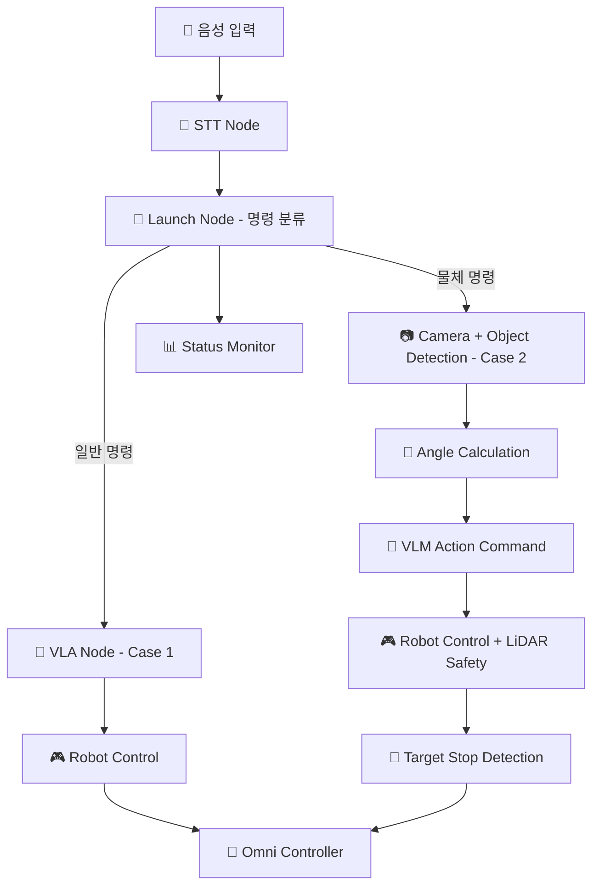

# 📅 VLA 프로젝트 이번 주 TODO (Case 1 & Case 2 통합)

**주차**: 2025년 5월 23일(금) - 5월 28일(수)  
**목표**: Case 1 완성 + Case 2 시나리오 구현

---

## 🎯 **통합 시나리오 개요**

### **📋 Case 1: Direct Control (직접 제어)**
- **플로우**: 음성 명령 → STT → VLA 추론 → 로봇 제어
- **상태**: STT 통합, VLA 최적화, 시스템 런치 완성 필요
- **우선순위**: 🔴 High (기본 시스템 안정화)

### **📋 Case 2: Object Navigation (물체 탐색 + 장애물 감지)**
- **플로우**: 음성 명령 → Object Detection → 각도 계산 → VLM 액션 → 로봇 제어 + LiDAR 장애물 감지 → 목표물 앞 정지
- **상태**: 새로운 기능 구현 (Object Detection + LiDAR 통합)
- **우선순위**: 🟡 Medium (확장 기능)

### **🔄 통합 아키텍처**


---

## 🎯 **이번 주 통합 목표**

| **목표** | **케이스** | **담당자** | **완료 기준** | **우선순위** |
|----------|------------|------------|---------------|-------------|
| 🎤 STT 시스템 완성 | Case 1 | @jiwoo | Whisper 통합 + Action Server | 🔴 High |
| 🧠 VLA 모델 최적화 | Case 1 | @이민우 @YUBEEN | PaliGemma 안정화 | 🔴 High |
| 🚀 시스템 런치 완성 | Case 1 | @양동건 | 전체 시스템 자동 실행 | 🔴 High |
| 📷 Object Detection 구현 | Case 2 | @이민우 @YUBEEN | 물체 3개 인식 | 🟡 Medium |
| 📐 각도 계산 알고리즘 | Case 2 | @이민우 @YUBEEN | 위치→각도 변환 | 🟡 Medium |
| 🛡️ LiDAR 장애물 감지 | Case 2 | @최용석 | 목표물 앞 정지 시스템 | 🟡 Medium |
| 🔧 하드웨어 안정화 | Both | @최용석 | 카메라 + 로봇 제어 최적화 | 🟢 Low |

---

## 📋 **역할별 상세 TODO**

## 🎤 **STT팀 (@jiwoo) - Case 1 완성 우선**

### **🔴 이번 주 핵심 미션**
Case 1의 STT 시스템 완성 (미완성 사항 해결)

### **📊 TODO 리스트**

#### **🥇 Case 1 - STT 시스템 완성 (최우선)**
```markdown
□ Day 1 (금): STT Docker 환경 완성
  ├── whisper_node.py 완전 구현
  ├── STT Action Server 구조 완성
  └── Docker 빌드 테스트

□ Day 2-3 (주말): STT 정확도 최적화  
  ├── Whisper 모델 파라미터 튜닝
  ├── 한국어 음성 인식 정확도 향상
  └── 잡음 환경 테스트

□ Day 4-5 (월-화): VLA팀과 통합 테스트
  ├── STT → VLA 노드 연결 테스트
  ├── Action 통신 안정성 검증
  └── End-to-End 시나리오 테스트
```

#### **🥈 Case 2 - 물체 명령 확장 (여유시)**
```markdown
□ Day 6 (수): Case 2 명령어 확장
  ├── "주스 잡으러 가" 같은 물체 명령어 추가
  ├── 명령어 분류 로직 구현
  └── AI팀과 연동 테스트
```

#### **🎯 핵심 결과물**
1. **완성된 STT Action Server**: 안정적인 음성→텍스트 변환
2. **통합 테스트 성공**: STT → VLA → Robot 전체 플로우
3. **명령어 분류기**: Case 1/Case 2 명령 구분

---

## 🧠 **AI팀 (@이민우 - Lead, @YUBEEN - Support)**

### **🔴 이번 주 핵심 미션**
Case 1 VLA 안정화 + Case 2 Object Detection 구현

### **📊 @이민우 (Lead) TODO**

#### **🥇 Case 1 - VLA 시스템 안정화 (최우선)**
```markdown
□ Day 1 (금): VLA 노드 버그 수정
  ├── 현재 vla_node.py 오류 디버깅
  ├── PaliGemma 모델 로딩 최적화
  └── 메모리 사용량 최적화

□ Day 2-3 (주말): VLA 추론 성능 향상
  ├── 추론 속도 최적화 (목표: 3초 이내)
  ├── cmd_vel 출력 안정성 개선
  └── 다양한 명령어 테스트

□ Day 4 (월): STT팀과 통합 테스트
  ├── STT Action → VLA 연동 테스트
  ├── 전체 파이프라인 안정성 검증
  └── 제어팀과 출력 형식 협의
```

#### **🥈 Case 2 - Object Detection 구현**
```markdown
□ Day 5-6 (화-수): Object Detection 구현
  ├── YOLO/DETR 모델 선택 및 통합
  ├── 물체 3개 동시 인식 테스트
  └── 좌표 계산 알고리즘 기초 구현
```

#### **🎯 핵심 결과물**
1. **안정된 VLA 노드**: Case 1 완전 동작
2. **Object Detection**: Case 2 기초 구현
3. **통합 인터페이스**: 제어팀과 협의된 출력 형식

---

### **📊 @YUBEEN (Support) TODO**

#### **🥇 Case 1 - VLA 성능 최적화 지원**
```markdown
□ Day 1-2: VLA 모델 최적화
  ├── PaliGemma 파라미터 최적화
  ├── 배치 처리 성능 개선
  └── 메모리 효율성 향상

□ Day 3-4: 테스트 시나리오 작성
  ├── 다양한 음성 명령 테스트 케이스
  ├── 에러 상황 처리 테스트
  └── 성능 벤치마크 측정
```

#### **🥈 Case 2 - Object Detection 알고리즘**
```markdown
□ Day 5-6: Object Detection 구현
  ├── 모델 정확도 향상 작업
  ├── 실시간 처리 최적화
  └── 위치 계산 알고리즘 설계
```

#### **🎯 핵심 결과물**
1. **VLA 성능 최적화**: 응답 시간 단축
2. **테스트 프레임워크**: 자동화된 테스트
3. **Object Detection 기초**: Case 2 알고리즘

---

## 🚗 **제어팀 (@양동건)**

### **🔴 이번 주 핵심 미션**
Case 1 시스템 런치 완성 + Case 2 파싱 시스템 설계

### **📊 TODO 리스트**

#### **🥇 Case 1 - 시스템 런치 및 통합 (최우선)**
```markdown
□ Day 1 (금): 시스템 런치 파일 완성
  ├── vla_system_launch.py 완전 구현
  ├── 모든 노드 자동 실행 설정
  └── 파라미터 및 토픽 매핑 완성

□ Day 2-3 (주말): 노드 간 통신 최적화
  ├── STT Action → VLA 노드 연결
  ├── VLA → Robot Control 안정화
  └── 에러 처리 및 복구 로직

□ Day 4-5 (월-화): End-to-End 테스트
  ├── 전체 시스템 통합 테스트
  ├── 음성 명령 → 로봇 동작 검증
  └── 성능 및 안정성 테스트
```

#### **🥈 Case 2 - 파싱 시스템 설계**
```markdown
□ Day 6 (수): Case 2 파싱 시스템 설계
  ├── Object Detection 결과 파싱 로직
  ├── 각도+속도 데이터 처리 설계
  └── AI팀과 인터페이스 협의
```

#### **🎯 핵심 결과물**
1. **완성된 런치 시스템**: 원클릭 전체 시스템 실행
2. **안정된 통합 테스트**: Case 1 완전 동작
3. **Case 2 설계**: 다음 주 구현 준비

#### **❓ 확인 필요사항**
- [ ] **@이민우에게 질문**: VLA 노드 현재 상태와 필요한 수정사항?
- [ ] **@jiwoo에게 질문**: STT Action 인터페이스 최종 형식?
- [ ] **전체 팀**: Case 1 완성 후 Case 2 우선순위 조정?

---

## 📷 **하드웨어팀 (@최용석)**

### **🔴 이번 주 핵심 미션**
카메라 및 로봇 제어 시스템 안정화 + LiDAR 장애물 감지 시스템 구현

### **📊 TODO 리스트**

#### **🥇 카메라 시스템 최적화**
```markdown
□ Day 1-2: 카메라 노드 안정화
  ├── 현재 camera_publisher_node.py 최적화
  ├── GStreamer 파이프라인 안정성 향상
  └── AI팀 요구사항에 맞는 이미지 품질 조정

□ Day 3-4: Object Detection 지원
  ├── Object Detection에 최적한 해상도/FPS 설정
  ├── 조명 조건별 화질 테스트
  └── AI팀과 성능 요구사항 협의
```

#### **🥈 LiDAR 장애물 감지 시스템 (Case 2 핵심)**
```markdown
□ Day 3-4: LiDAR 센서 통합
  ├── LiDAR 센서 드라이버 설정 및 테스트
  ├── 장애물 감지 알고리즘 구현
  ├── 목표물과 장애물 구분 로직
  └── 안전 거리 기반 정지 시스템

□ Day 5-6: 로봇 제어 시스템 개선
  ├── 옴니휠 제어 정확도 테스트
  ├── LiDAR + PSD/Ultrasonic 센서 융합
  ├── Case 2: VLM 액션 + LiDAR 안전 제어 통합
  └── Case 1, 2 통합 테스트 지원
```

#### **🎯 핵심 결과물**
1. **안정된 카메라 시스템**: Case 1, 2 모두 지원
2. **LiDAR 장애물 감지**: 목표물 앞 정확한 정지
3. **정밀 로봇 제어**: 일관된 동작 성능 + 안전 시스템
4. **통합 테스트 지원**: 하드웨어 관련 문제 해결

#### **🛡️ LiDAR 시스템 요구사항**
- **감지 범위**: 전방 120도, 0.1~3.0m
- **정지 거리**: 목표물로부터 30-50cm
- **반응 속도**: 100ms 이내 긴급 정지
- **목표물 구분**: Object Detection 결과와 LiDAR 데이터 융합

---

## 📊 **일일 협업 일정**

### **🤝 Daily Sync (매일 오후 6시)**
- **Day 1 (금)**: 킥오프 - Case 1 완성 우선순위 확인
- **Day 2-3 (주말)**: 개별 작업 진행 (Slack 진행상황 공유)
- **Day 4 (월)**: 중간 점검 - Case 1 통합 테스트 준비
- **Day 5 (화)**: Case 1 End-to-End 테스트
- **Day 6 (수)**: 주간 리뷰 + Case 2 다음 주 계획

### **🔗 핵심 연동 포인트**

#### **STT ↔ AI팀 (Case 1 최우선)**
- **STT Action 인터페이스**: 완전 구현 및 테스트
- **VLA 노드 연동**: 안정적인 음성→행동 변환
- **에러 처리**: STT 실패시 재시도 로직

#### **AI ↔ 제어팀 (Case 1 완성)**  
- **VLA 출력 형식**: cmd_vel 최적화
- **런치 시스템**: 모든 노드 자동 실행
- **통합 테스트**: End-to-End 시나리오

#### **전체팀 (Case 2 설계)**
- **아키텍처 설계**: Object Detection 통합 방법
- **인터페이스 정의**: 각도 계산 → 로봇 제어
- **다음 주 계획**: Case 2 구현 로드맵

---

## 🎯 **주간 마일스톤**

### **✅ Case 1 완성 기준 (Must Have)**
- [ ] **STT 시스템**: Whisper 완전 동작
- [ ] **VLA 노드**: 안정적인 추론 및 cmd_vel 출력  
- [ ] **시스템 런치**: 원클릭 전체 시스템 실행
- [ ] **End-to-End**: 음성 명령 → 로봇 동작 성공

### **✅ Case 2 설계 기준 (Should Have)**
- [ ] **Object Detection**: 기본 구현 완료
- [ ] **각도 계산**: 알고리즘 설계 완료
- [ ] **인터페이스**: AI-제어팀 협의 완료
- [ ] **다음 주 계획**: Case 2 구현 로드맵

### **✅ 시스템 안정성 (Nice to Have)**
- [ ] **연속 운영**: 30분 이상 안정 동작
- [ ] **에러 복구**: 노드 재시작 자동화
- [ ] **성능 최적화**: 응답 시간 5초 이내

---

## 🚨 **리스크 및 대응방안**

### **⚠️ Case 1 완성 리스크**

| **리스크** | **확률** | **영향도** | **대응방안** | **담당자** |
|------------|----------|------------|-------------|------------|
| STT 통합 지연 | 높음 | 높음 | 간단한 텍스트 입력으로 대체 | @jiwoo |
| VLA 모델 불안정 | 중간 | 높음 | 사전 정의된 명령어로 우회 | @이민우 |
| 하드웨어 문제 | 낮음 | 높음 | 시뮬레이션 모드로 대체 | @최용석 |
| 시스템 통합 실패 | 중간 | 중간 | 개별 노드 테스트 우선 | @양동건 |

### **🛡️ 비상 계획 (Backup Plan)**
- **Plan B**: Case 1만 완성하고 Case 2는 다음 주로 연기
- **Plan C**: 핵심 기능만 구현하고 세부 최적화는 후순위
- **Plan D**: 하드웨어 문제시 시뮬레이션으로 기능 검증

---

## 📈 **진행상황 추적**

### **📊 Daily Progress Tracker**

| **팀** | **금** | **주말** | **월** | **화** | **수** |
|--------|--------|----------|--------|--------|--------|
| 🎤 STT팀 | 🔴 Docker완성 | 🟡 모델튜닝 | 🟢 VLA연동 | 🟢 통합테스트 | 🔵 Case2설계 |
| 🧠 AI팀 | 🔴 VLA디버깅 | 🟡 성능최적화 | 🟢 통합테스트 | 🟡 ObjectDetection | 🔵 Case2구현 |
| 🚗 제어팀 | 🔴 런치완성 | 🟡 통신최적화 | 🟢 End-to-End | 🟢 안정성테스트 | 🔵 Case2설계 |
| 📷 하드웨어팀 | 🟡 카메라최적화 | 🟢 AI지원 | 🟡 로봇제어 | 🟢 통합지원 | 🔵 시스템검증 |

**범례**: 🔴 계획/설계 | 🟡 개발진행 | 🟢 구현완료 | 🔵 테스트/검증

---

## 🏆 **주간 성과 리뷰**

### **📋 수요일 데모 시나리오**

#### **🥇 Case 1 데모 (필수)**
1. **시스템 실행**: `ros2 launch vla_system_launch.py`
2. **음성 명령**: "앞으로 가" 
3. **STT 처리**: 음성 → 텍스트 변환
4. **Launch Node**: 명령 분류 → VLA Node 호출
5. **VLA 추론**: 텍스트 → cmd_vel 생성
6. **로봇 동작**: 실제 로봇 전진 동작
7. **결과**: 완전한 End-to-End 성공 (STT → Launch → VLA → Robot)

#### **🥈 Case 2 프로토타입 (가능시)**
1. **음성 명령**: "주스 잡으러 가"
2. **Launch Node**: Case 2 명령 인식
3. **Object Detection**: 주스 물체 인식 및 위치 계산
4. **각도 계산**: 주스 방향으로의 이동 각도
5. **VLM 액션**: 목표 지향 이동 명령 생성
6. **로봇 이동**: LiDAR 장애물 감지하며 이동
7. **목표 도달**: 주스 앞 30cm에서 자동 정지
8. **결과**: Case 2 완전한 물체 탐색 + 안전 정지 성공

### **🎯 KPI (핵심 성과 지표)**
- **Case 1 성공률**: 목표 90% / 실제 ___%
- **STT 정확도**: 목표 95% / 실제 ___%
- **VLA 응답시간**: 목표 5초 / 실제 ___초  
- **시스템 안정성**: 목표 30분 / 실제 ___분
- **Case 2 LiDAR 정지 정확도**: 목표 ±5cm / 실제 ___cm

---

## 🔄 **다음 주 계획 (5/29 - 6/4)**

### **📅 다음 주 우선순위**
1. **Case 2 본격 구현**: Object Detection + 각도 계산 + LiDAR 통합
2. **Case 1 성능 최적화**: 응답 속도 및 정확도 향상  
3. **통합 시스템**: Case 1, 2 자동 전환 시스템
4. **안전 시스템**: LiDAR 기반 완전한 장애물 회피
5. **사용자 인터페이스**: 음성 피드백 및 상태 표시

---

**🚀 Case 1 완성이 최우선! 안정적인 기본 시스템을 만든 후 Case 2로 확장합시다!**

**📞 문제 발생시 즉시 팀 채널에 공유하고 서로 도움을 요청하세요!** 